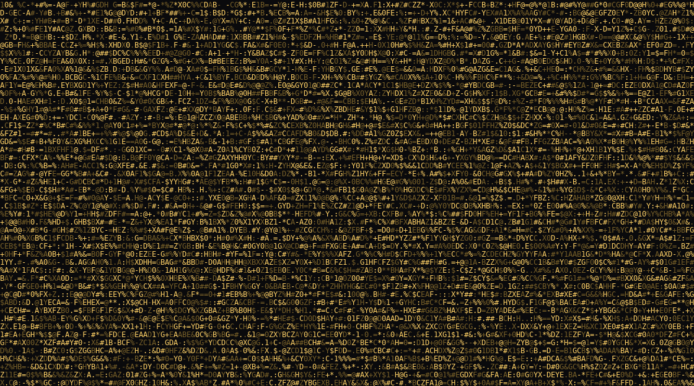

<div align="center">


</div>

<br>

<div align="center">


</div>

<br>

<div align="center">



<sub>rendered in ASCII from a single photo · noise settles into signal</sub>

</div>

<br>


```bash
alwin@cec:~/projects$ ls -la --sort-by=recent
```

| project | stack | status |
|---|---|---|
| **StudyMind** | LangChain · FastAPI · Next.js | RAG-based AI study assistant |
| **Chrono Executive OS** | Vite · SQLite · Ollama (local AI) | Personal day planner with RAG chat, AI-generated study plans, adherence analytics |
| **Mementos** | Supabase Realtime · Cloudflare R2 | Real-time event photo distribution, QR-slug mechanic |
| **IEEE SB CEC Website** | — | Full site rebuild, cecieee.org |
| **10D10T** | — | IEEE competition site — space theme, astronaut hero, dot-matrix countdown |
| **Season of Code** | — | GDG event site — dot-matrix type, clip-path mouse-reveal |
| **Portfolio** | React · Vite · TS · Tailwind · Framer Motion · GSAP | ASCII-art hero, scroll-driven SVG→QR animation → [alwinsaji.netlify.app](https://alwinsaji.netlify.app) |

<br>


```bash
alwin@cec:~$ cat skills.json
```

```json
{
  "languages":   ["Python", "TypeScript"],
  "frontend":    ["React", "Vite", "Tailwind", "Framer Motion", "GSAP"],
  "backend":     ["FastAPI", "LangChain"],
  "ml_ai":       ["scikit-learn", "PyTorch (learning)", "RAG pipelines"],
  "currently_learning": ["DSA — NeetCode 150", "AI/ML — StatQuest / CampusX", "Docker", "SQL depth"]
}
```

<br>


```bash
alwin@cec:~$ gh stats --user Alwin-Saji
```

<div align="center">


</div>

<br>


<div align="center">


</div>

<br>


<picture>
  <source media="(prefers-color-scheme: dark)" srcset="https://raw.githubusercontent.com/Alwin-Saji/Alwin-Saji/output/github-contribution-grid-snake-dark.svg" />
  <source media="(prefers-color-scheme: light)" srcset="https://raw.githubusercontent.com/Alwin-Saji/Alwin-Saji/output/github-contribution-grid-snake.svg" />
  
</picture>


<br>


```bash
alwin@cec:~$ contact --list
```


```
> portfolio   alwinsaji.netlify.app
> email       your.email@example.com
> github      github.com/Alwin-Saji
> linkedin    linkedin.com/in/YOUR_LINKEDIN_HANDLE
```

<div align="center">

```
$ echo "designed before built, always."
```

</div>